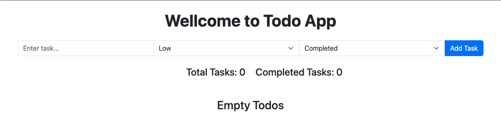
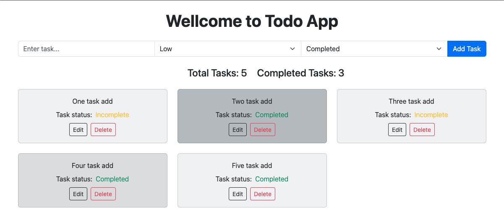
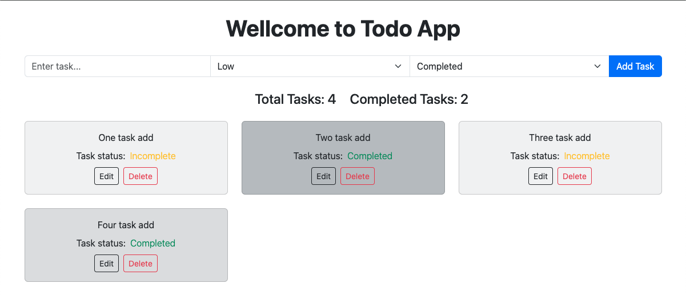
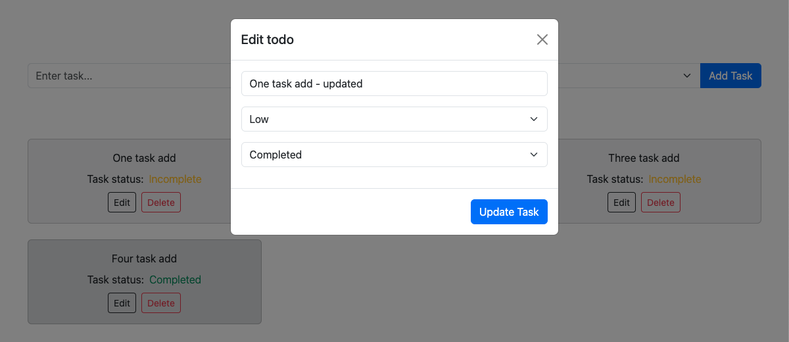
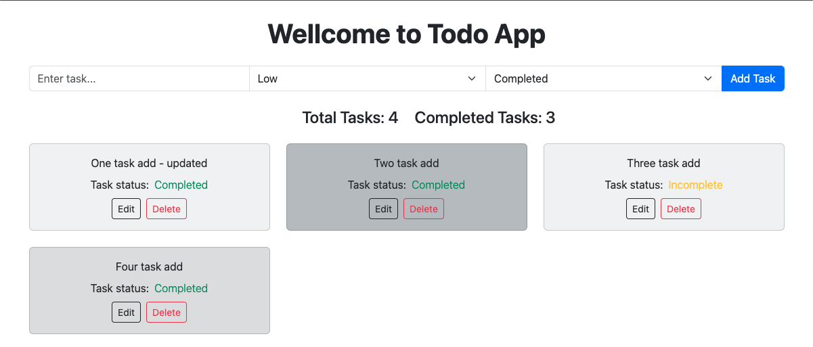

This is a responsive online todo web app. I have built on a Frontend NextJs App Router.

This web app using dependencies are:
```bash
"bootstrap": "^5.3.0",
```

Application functionality are:
- Display a list of tasks with their respective status (completed or not completed).
- Each task should have options to mark as completed or delete.
- Include a counter for total tasks and completed tasks.
- Implement the ability to add, edit, delete.
- Each task will also have a priority (low/ medium/ high) and show the color which will indicate the task’s priority in the tasklist.
- responsive design large, laptop, tablet, mobile screen.

## Getting Started
Don't refresh the page.

1. First download the code and run:
```bash
npm install
```

2. Run the development server:
```bash
npm run dev
```

Open [http://localhost:3000](http://localhost:3000) with your browser to see the result.

## Todo App view
Main Home Page


Add task and should tasks priority basis color


Delete task


Edit task


Update task list

